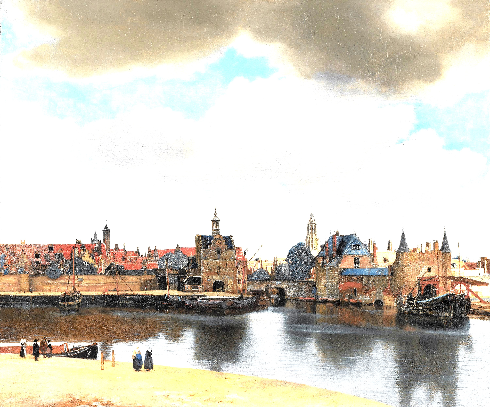
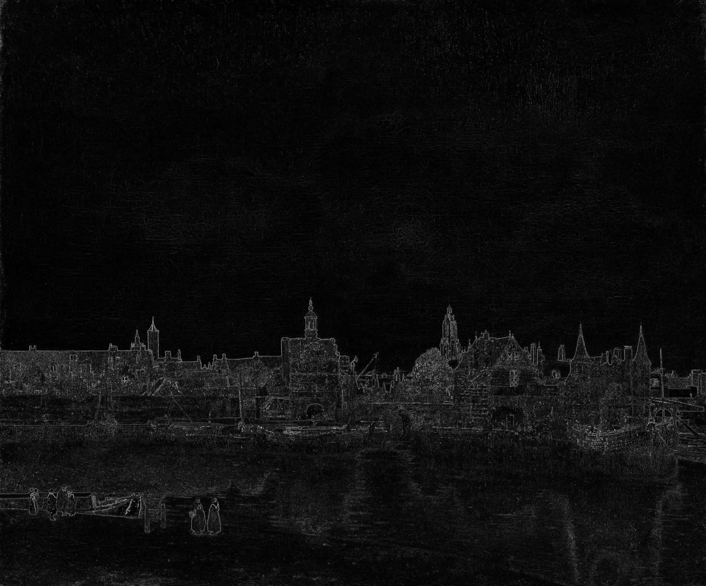
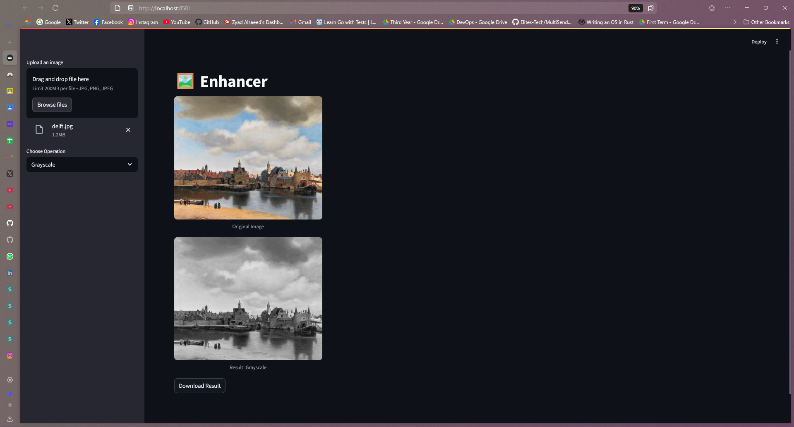

# Image Enhancer - Technical Documentation

## Table of Contents
1. [Project Overview](#project-overview)
2. [System Architecture](#system-architecture)
3. [Features and Implementation](#features-and-implementation)
4. [User Interfaces](#user-interfaces)
5. [Installation and Setup](#installation-and-setup)
6. [Usage Guide](#usage-guide)
7. [Available Filters](#available-filters)

## Project Overview

The Image Enhancer is a comprehensive image processing application that provides both command-line and web-based interfaces for image manipulation and enhancement. The project is built using Python and leverages popular libraries such as OpenCV, NumPy, and Streamlit.


## System Architecture

The application follows a modular architecture with clear separation of concerns:

```
Enhancer/
├── streamlit_app.py      # Web interface implementation
├── main.py              # CLI implementation
├── filters.py           # Core image processing functions
├── utils.py             # Utility functions
├── noise_filter_helper.py
├── noiseRemovalFilter.py
├── InvertColorFilter.py
├── edge_helpers.py
├── brightness_helpers.py
└── images/              # Directory for sample images and documentation
```

## Features and Implementation

### 1. Image Enhancement Features

#### Brightness Adjustment
- Implementation details
- Supported parameters
- Example usage


*Figure 3: Example of brightness adjustment*

#### Noise Management
- Gaussian noise addition
- Salt & Pepper noise
- Noise removal techniques
  - Gaussian filtering
  - Median filtering
  - Bilateral filtering


*Figure 4: Example of noise management*

#### Edge Detection
- Implementation details
- Available algorithms
- Performance considerations


*Figure 5: Edge detection results*

### 2. Core Components

#### Filter System
- Filter interface design
- Extensibility
- Performance optimizations

#### Image Processing Pipeline
- Input validation
- Processing workflow
- Output handling

## User Interfaces

### Web Interface (Streamlit)

The Streamlit interface provides an intuitive way to interact with the image processing features:


*Figure 6: Streamlit web interface screenshot*

Key features:
- Image upload
- Parameter adjustment
- Real-time preview
- Download processed images

### Command Line Interface


## Installation and Setup

### Prerequisites
- Python 3.7+
- pip
- Virtual environment (recommended)

### Installation Steps
1. Clone the repository
2. Create virtual environment
3. Install dependencies
4. Verify installation

## Usage Guide

### Web Interface Usage
1. Launch the application
2. Upload an image
3. Select processing options
4. Adjust parameters
5. Download results

### CLI Usage
1. Basic commands
2. Advanced options
3. Batch processing
4. Output customization

## Available Filters

The Image Enhancer provides a comprehensive set of image processing filters. Here's a detailed overview of each filter and its functionality:

### 1. Brightness Filter
- **Function**: `apply_brightness(image, level)`
- **Description**: Adjusts the brightness of an image by a specified level
- **Parameters**:
  - `level`: Integer value from -4 to 4
  - Negative values darken the image
  - Positive values brighten the image
- **Example Usage**:
```python
# Darken image
result = apply_brightness(image, level=-2)

# Brighten image
result = apply_brightness(image, level=2)
```

### 2. Grayscale Filter
- **Function**: `apply_grayscale(image)`
- **Description**: Converts a color image to grayscale using perceptual weights
- **Implementation**: Uses weighted RGB channels (R: 0.299, G: 0.587, B: 0.114)
- **Example Usage**:
```python
grayscale_image = apply_grayscale(color_image)
```

### 3. Noise Filters
#### 3.1 Gaussian Noise
- **Function**: `add_gaussian_noise(image, intensity)`
- **Description**: Adds random Gaussian noise to the image
- **Parameters**:
  - `intensity`: Controls the amount of noise (default: 0.1)

#### 3.2 Salt & Pepper Noise
- **Function**: `add_salt_pepper_noise(image, intensity)`
- **Description**: Adds random black and white pixels to the image
- **Parameters**:
  - `intensity`: Controls the amount of noise (default: 0.1)

### 4. Noise Removal Filters
#### 4.1 Median Filter
- **Function**: `remove_noise(image, method="median")`
- **Description**: Removes salt & pepper noise while preserving edges
- **Parameters**:
  - `ksize`: Kernel size (default: 5)

#### 4.2 Gaussian Filter
- **Function**: `remove_noise(image, method="gaussian")`
- **Description**: Smooths the image using Gaussian blur
- **Parameters**:
  - `ksize`: Kernel size (default: (5,5))
  - `sigma`: Standard deviation (default: 0)

#### 4.3 Bilateral Filter
- **Function**: `remove_noise(image, method="bilateral")`
- **Description**: Edge-preserving smoothing filter
- **Parameters**:
  - `d`: Diameter of pixel neighborhood
  - `sigma_color`: Filter sigma in color space
  - `sigma_space`: Filter sigma in coordinate space

### 5. Edge Detection Filter
- **Function**: `apply_edge_detection(image, sensitivity, direction)`
- **Description**: Detects edges using Sobel operators
- **Parameters**:
  - `sensitivity`: Edge detection sensitivity (default: 1.0)
  - `direction`: 'horizontal', 'vertical', or 'both'

### 6. Color Inversion Filter
- **Function**: `apply_invert(image)`
- **Description**: Creates a negative version of the image
- **Implementation**: Inverts each pixel value (255 - value)

### Filter Working Example

Let's take a detailed look at how the Brightness Filter works:

1. **Input Processing**:
```python
def apply_brightness(image, level=0):
    # Convert level to brightness factor
    factor = get_brightness_factor(level)
    
    # Apply brightness adjustment
    adjusted = image * factor
    
    # Ensure values stay within valid range (0-255)
    result = np.clip(adjusted, 0, 255)
    
    # Convert back to uint8
    return result.astype(np.uint8)
```

2. **Brightness Factor Calculation**:
```python
def get_brightness_factor(level):
    # Convert level (-4 to 4) to a brightness factor
    # Level 0 = factor 1.0 (no change)
    # Level -4 = factor 0.4 (darker)
    # Level 4 = factor 1.6 (brighter)
    return 1.0 + (level * 0.15)
```

3. **Usage Example**:
```python
# Load an image
image = cv2.imread('input.jpg')

# Apply brightness adjustment
brightened = apply_brightness(image, level=2)  # Increase brightness
darkened = apply_brightness(image, level=-2)   # Decrease brightness

# Save results
cv2.imwrite('brightened.jpg', brightened)
cv2.imwrite('darkened.jpg', darkened)
```

The filter pipeline ensures that:
- Input values are properly validated
- Brightness adjustments are applied uniformly
- Output values remain within valid range
- Image quality is preserved
- Processing is efficient

---

*Note: This documentation is a living document and will be updated as the project evolves. For the most up-to-date information, please refer to the repository.*

*Last updated: [Current Date]* 