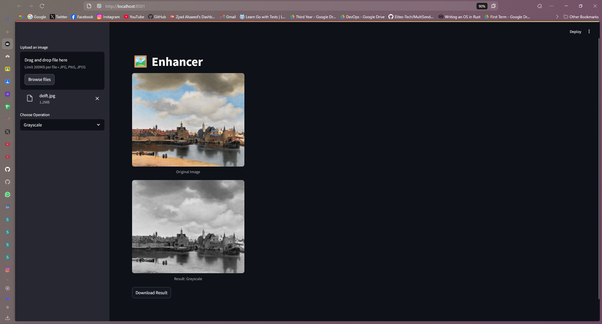

# Image Enhancer

A powerful image processing application that provides various image enhancement and manipulation features through both a command-line interface and a user-friendly Streamlit web interface.



## Features

- **Image Adjustment**
  - Brightness adjustment (multiple levels)
  - Grayscale conversion
  - Color inversion
  - Image sharpening with unsharp mask
  - Color channel manipulation

- **Edge Detection**
  - Horizontal, vertical, or both directions
  - Adjustable sensitivity (0.1 to 2.0)
  - Integrated into the Streamlit app
  - Focus metrics (Variance of Laplacian, Sobel Energy)

- **Noise Management**
  - Add noise (Gaussian and Salt & Pepper)
  - Remove noise (Gaussian Blur, Median Filter, Bilateral Filter)

## Prerequisites

- Python 3.7 or higher
- pip (Python package installer)

## Installation

1. Clone the repository:
```bash
git clone https://github.com/yourusername/Enhancer.git
cd Enhancer
```

2. Create and activate a virtual environment (recommended):
```bash
# On Windows
python -m venv .venv
.venv\Scripts\activate

# On macOS/Linux
python -m venv .venv
source .venv/bin/activate
```

3. Install the required dependencies:
```bash
pip install -r requirements.txt
```

## Usage

### Streamlit Web Interface

The web interface provides an intuitive way to apply filters and enhancements:

```bash
streamlit run streamlit_app.py
```

Features of the web interface:
- Simple image upload via the sidebar
- Interactive sliders and controls for filter parameters
- Real-time preview of processed images
- One-click download of processed results
- Quantitative metrics for image enhancement evaluation

### Command Line Interface

For batch processing or scripting, use the command-line interface:

```bash
python main.py
```

The CLI will guide you through:
1. Loading an image from your filesystem
2. Selecting from available filters and operations
3. Setting parameters for the selected operation
4. Saving and displaying the processed image

## Project Architecture

```
Enhancer/
├── streamlit_app.py           # Web interface implementation
├── main.py                    # CLI implementation
├── filters.py                 # Core image processing functions
├── utils.py                   # Utility functions
├── noise_filter_helper.py     # Noise filter helpers
├── noiseRemovalFilter.py      # Noise removal filter
├── InvertColorFilter.py       # Color inversion filter
├── Quantitative_Proof.py      # Quantitative proof script
├── benchmark_edge.py          # Edge detection benchmarking
├── requirments.txt            # Project dependencies
├── helpers/
│   ├── brightness_helpers.py
│   ├── channel_swap_helpers.py
│   ├── edge_helpers.py
│   ├── gaussian_noise_helpers.py
│   ├── noise_filter_helper.py
│   ├── salt_pepper_noise_helpers.py
│   └── unsharp_mask_helpers.py
├── images/
│   ├── The_Mill.jpg
│   ├── brightness_example.png
│   ├── delft.jpg
│   ├── edge_detection.png
│   ├── edges_both_2.0.jpg
│   ├── inverted.jpg
│   ├── noise_examples.png
│   ├── ozzy.jpg
│   ├── streamlit.png
│   └── sudi.jpg
└── README.md 
```

## Sample Results

The application can produce various effects:

- Brightness adjustments
- Edge detection
- Noise addition/removal
- Grayscale conversion
- Color inversion
- Image sharpening
- Color channel manipulation

## Documentation

For more detailed technical information, see the [DOCUMENTATION.md](DOCUMENTATION.md) file.

## Contributing

Contributions are welcome! Feel free to submit issues and enhancement requests.

## License

This project is licensed under the MIT License - see the LICENSE file for details.
